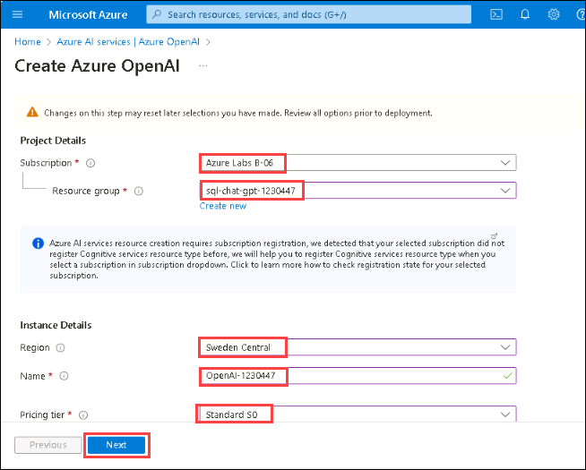
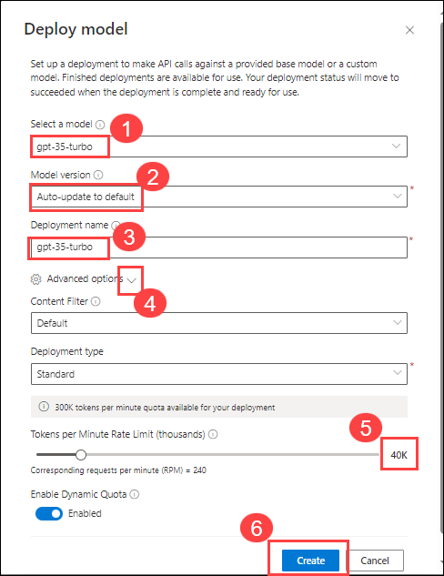

# Deploy Azure OpenAI Models

Welcome to Contoso Corporation's AI exploration lab! In this exercise, you'll embark on a journey to integrate Azure OpenAI into your workflow.

### Estimated Time: 30 minutes

## Lab Scenario
 
 Contoso Corporation, an innovator in engineering practices, has embraced the dynamic duo of Microsoft Azure and OpenAI. In this exercise, you'll delve into creating a deployment and model using Azure OpenAI Studio.
  
## Lab Objective

In this exercise, you will perform the following:
- Deploy Azure OpenAI Model.
- Deploy a model

## Task 1: Deploy Azure OpenAI Model.

1. In the **Azure portal**, search for **OpenAI** and select **Azure OpenAI**.

   

2. On **Azure AI Services | Azure OpenAI** blade, click on **Create**.

   

3. Create an **Azure OpenAI** resource with the following settings:
   
    - **Subscription**: Default-Pre-assigned subscription. (1)
    - **Resource group**: sql-chat-gpt-<inject key="Deployment ID" enableCopy="false"></inject> (2)
    - **Region**: Sweden Central (3)
    - **Name**: OpenAI-<inject key="Deployment ID" enableCopy="false"></inject> (4)
    - **Pricing tier**: Standard S0 (5)
    -  Click **Next** (6)
  
      
      
      >**Note:** Kindly select Sweden Central region only as the resources are region-specific.

4. Keep rest as default click on Next twice and subsequently click on **Create** .
5. Wait for deployment to complete. Then go to the deployed Azure OpenAI resource in the Azure portal.

> **Congratulations** on completing the task! Now, it's time to validate it. Here are the steps:
  > - Navigate to the Lab Validation tab, from the upper right corner in the lab guide section.
  > - Hit the Validate button for the corresponding task. If you receive a success message, you can proceed to the next task. 
  > - If not, carefully read the error message and retry the step, following the instructions in the lab guide.
  > - If you need any assistance, please contact us at labs-support@spektrasystems.com.

### Task 2: Deploy a model

Azure OpenAI provides a web-based portal named **Azure OpenAI Studio**, that you can use to deploy, manage, and explore models. You'll start your exploration of Azure OpenAI by using Azure OpenAI Studio to deploy a model.

1. In the **Azure portal**, search for **OpenAI** and select **Azure OpenAI**.

   

2. On **Azure AI Services | Azure OpenAI** blade, select **OpenAI-<inject key="Deployment ID" enableCopy="false"></inject>**

   

3. In the Azure OpenAI resource pane, click on **Go to Azure OpenAI Studio** it will navigate to **Azure AI Studio**.

   
   
5. In **Welcome to Azure OpenAI Service** page, click on **Create new deployment**.

   

6. In the **Deployments** page, click on **+ Create new deployment**.

   

7. Within the **Deploy model** pop-up interface, enter the following details and then click on **Advanced options (4)** followed by scaling down the **Tokens per Minute Rate Limit (thousands) (5)**:
    
    - **Select a Model**: gpt-35-turbo (1)
    - **Model version**: Auto-update to default (2)
    - **Deployment name**: gpt-35-turbo (3)
    - **Tokens per Minute Rate Limit (thousands)**: 40K (5)

      

8. Click on the **Create** (6) button to deploy a model that you will be playing around with as you proceed.

    **Note:** Azure OpenAI includes multiple models, each optimized for a different balance of capabilities and performance. In this exercise, you'll use the **GPT-35-Turbo** model, which is a good general model for summarizing and generating natural language and code. For more information about the available models in Azure OpenAI, see [Models](https://learn.microsoft.com/azure/cognitive-services/openai/concepts/models) in the Azure OpenAI documentation.

  > **Congratulations** on completing the task! Now, it's time to validate it. Here are the steps:
  > - Navigate to the Lab Validation tab, from the upper right corner in the lab guide section.
  > - Hit the Validate button for the corresponding task. If you receive a success message, you can proceed to the next task. 
  > - If not, carefully read the error message and retry the step, following the instructions in the lab guide.
  > - If you need any assistance, please contact us at labs-support@spektrasystems.com.

## Review

In this lab we have completed the following:

- Deployed Azure OpenAI Model.
- Deployed a model

## Summary

In this lab, you deployed an Azure OpenAI model using Azure OpenAI Studio, created and configured a deployment resource, and deployed the GPT-35-Turbo model

## You have successfully completed the lab.
