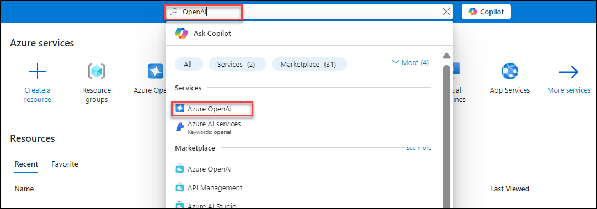
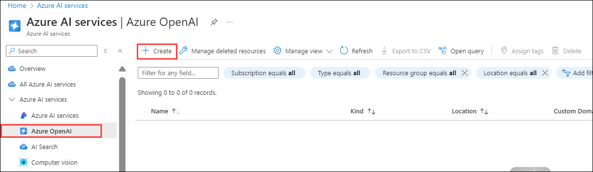
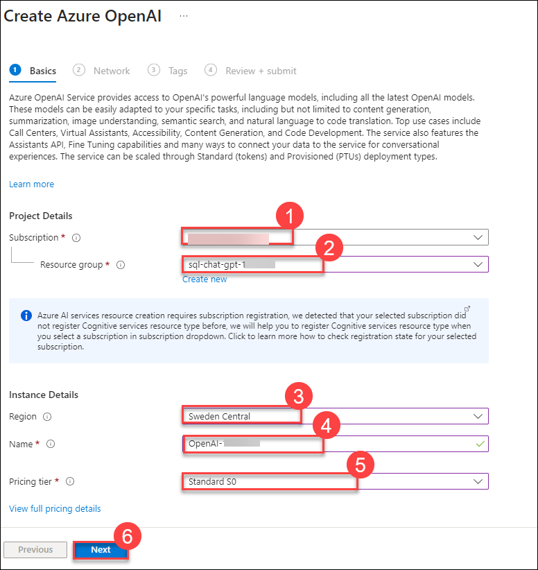
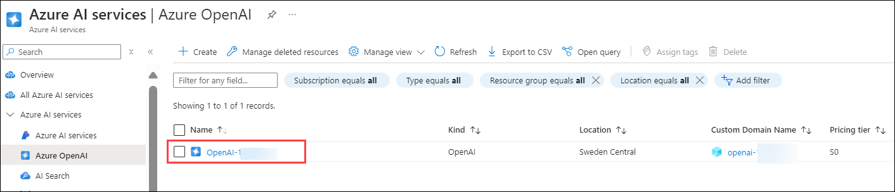
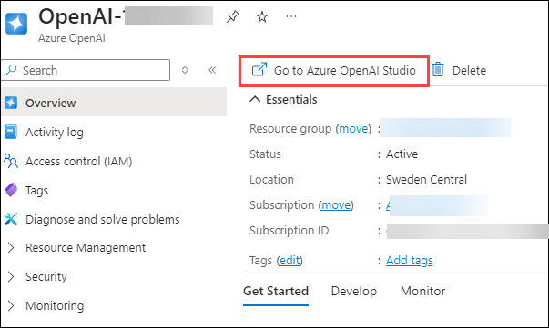
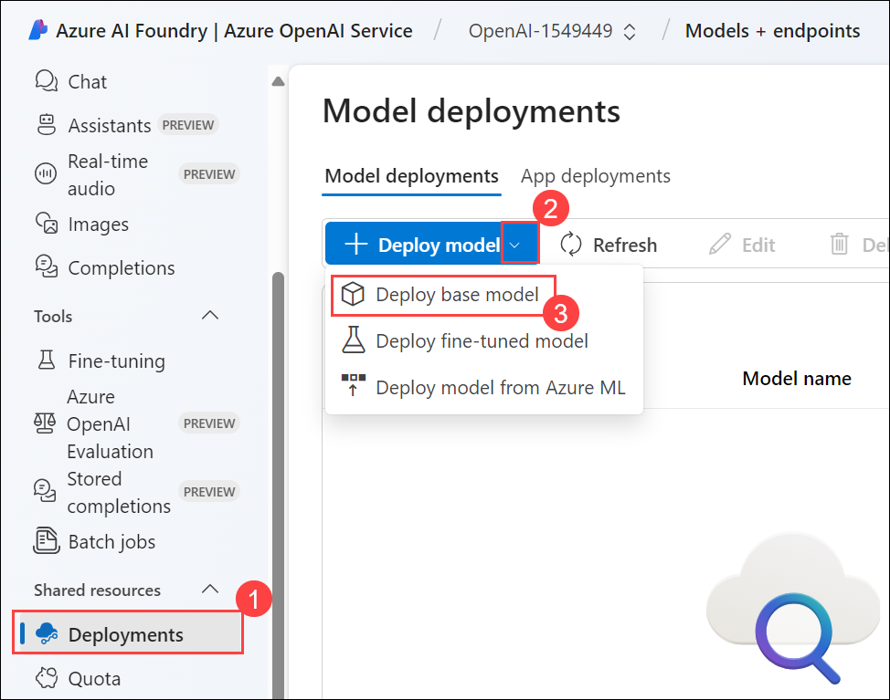
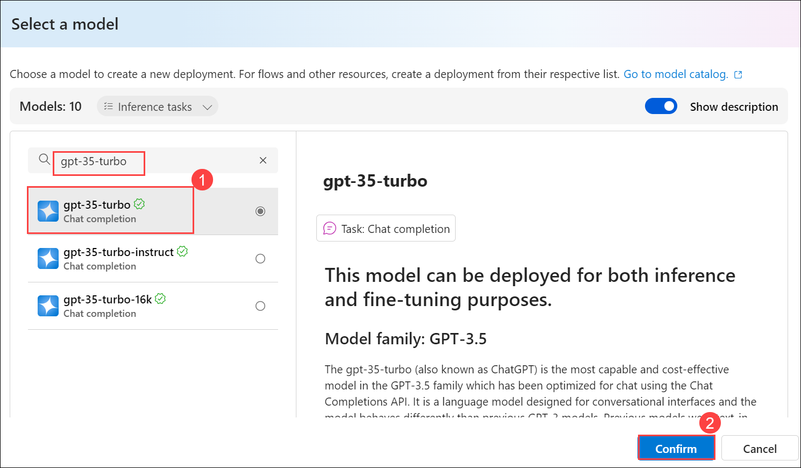
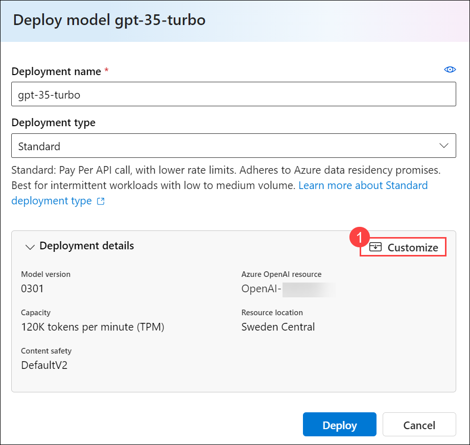
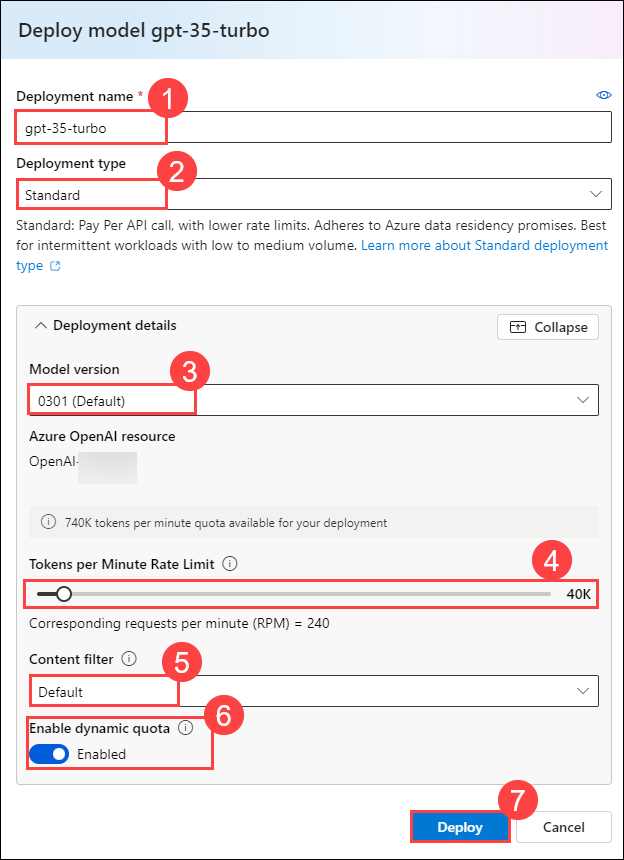

# Deploy Azure OpenAI Models

Welcome to Contoso Corporation's AI exploration lab! In this exercise, you'll embark on a journey to integrate Azure OpenAI into your workflow.

### Estimated Time: 30 minutes

## Lab Scenario
 
 Contoso Corporation, an innovator in engineering practices, has embraced the dynamic duo of Microsoft Azure and OpenAI. In this exercise, you'll delve into creating a deployment and model using Azure OpenAI Studio.
  
## Lab Objective

In this exercise, you will perform the following:
- Deploy Azure OpenAI Model.
- Deploy a model

## Task 1: Deploy Azure OpenAI Model.

In this task, you will deploy an Azure OpenAI model by setting up an instance, configuring resources, and making the model ready for use in Azure.

1. In the **Azure portal**, search for **OpenAI** and select **Azure OpenAI**.

   

1. On **Azure AI Services | Azure OpenAI** blade, click on **Create**.

   

1. Create an **Azure OpenAI** resource with the following settings:
   
    - **Subscription**: Default-Pre-assigned subscription. **(1)**
    - **Resource group**: sql-chat-gpt-<inject key="Deployment ID" enableCopy="false"></inject> **(2)**
    - **Region**: Sweden Central **(3)**
    - **Name**: OpenAI-<inject key="Deployment ID" enableCopy="false"></inject> **(4)**
    - **Pricing tier**: Standard S0 **(5)**
    -  Click **Next** (6)
  
      
      
      >**Note:** Kindly select Sweden Central region only as the resources are region-specific.

4. Keep rest as default click on Next twice and subsequently click on **Create** .
5. Wait for deployment to complete. Then go to the deployed Azure OpenAI resource in the Azure portal.

    > **Congratulations** on completing the task! Now, it's time to validate it. Here are the steps:
   - If you receive a success message, you can proceed to the next task.
   - If not, carefully read the error message and retry the step, following the instructions in the lab guide.
   - If you need any assistance, please contact us at cloudlabs-support@spektrasystems.com. We are available 24/7 to help you out.
 
   <validation step="c0099286-0167-4315-a0c3-f68942deeade" />

### Task 2: Deploy a model

Azure OpenAI provides a web-based portal named **Azure OpenAI Studio**, that you can use to deploy, manage, and explore models. You'll start your exploration of Azure OpenAI by using Azure OpenAI Studio to deploy a model.

1. In the **Azure portal**, search for **OpenAI** and select **Azure OpenAI**.

   

1. On **Azure AI Services | Azure OpenAI** blade, select **OpenAI-<inject key="Deployment ID" enableCopy="false"></inject>**

   

1. In the Azure OpenAI resource pane, click on **Go to Azure OpenAI Studio** it will navigate to **Azure AI Studio**.

   
   
1. On the **Azure OpenAI Service** page, click on **Deployment (1)** from the left naviagtion pane, select the **+ Deploy model (2)** drop down and then click on **Deploy base model (3)**

   

1. On the **Select a model** page, search and select **gpt-35-turbo (1)** and click on **Confirm (2).**

   

1. On the **Deploy model gpt-35-turbo** pop-up interface, click on **Customize (1)**
   
   

1. Within the **Deploy model gpt-35-turbo** pop-up interface, enter the following details and then click on **Deploy (7)** button to deploy a model that you will be playing around with as you proceed.
     
    - **Deployment name**: gpt-35-turbo **(1)**
    - **Deployment Type**: Standard **(2)**
    - **Model version**: Select Auto-update to default **(3)**
    - **Tokens per Minute Rate Limit (thousands)**: 40K **(4)**
    - **Content Filter**: Default **(5)**
    -  **Enable Dynamic Quota**: Enabled **(6)**
   

      

   

    **Note:** Azure OpenAI includes multiple models, each optimized for a different balance of capabilities and performance. In this exercise, you'll use the **GPT-35-Turbo** model, which is a good general model for summarizing and generating natural language and code. For more information about the available models in Azure OpenAI, see [Models](https://learn.microsoft.com/azure/cognitive-services/openai/concepts/models) in the Azure OpenAI documentation.

    > **Congratulations** on completing the task! Now, it's time to validate it. Here are the steps:
   - If you receive a success message, you can proceed to the next task.
   - If not, carefully read the error message and retry the step, following the instructions in the lab guide.
   - If you need any assistance, please contact us at cloudlabs-support@spektrasystems.com. We are available 24/7 to help you out.
 
   <validation step="5502b06f-51ca-4a73-bb22-cdbe1e244193" />

## Review

In this lab we have completed the following:

- Deployed Azure OpenAI Model.
- Deployed a model

## Summary

In this lab, you deployed an Azure OpenAI model using Azure OpenAI Studio, created and configured a deployment resource, and deployed the GPT-35-Turbo model

## You have successfully completed the lab.
