# Exercise 1: Open AI Setup and Installation of Application

### Estimated Duration : 150 Minutes

In this exercise, you will configure the Azure OpenAI resource and deploy a Streamlit-based application to Azure. The solution features SQL and data analysis assistants powered by ChatGPT. Using the Azure Developer CLI, you will perform an end-to-end deployment, gaining practical experience in building and hosting AI-driven applications on Azure.

## Objectives

You will be able to complete the following tasks:

- Task 1: Review Open AI resource

- Task 2: Deploy the application to Azure

## Task 1: Review Open AI resource

In this task, you will be reviewing the OpenAI deployments.

1. In the Azure portal, search for **Azure OpenAI (1)** in the top search box, then select **Azure OpenAI (2)** under services.

   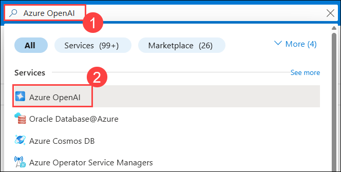
   
1. From the **Azure AI services | Azure OpenAI** pane, select **SQL-OpenAI-<inject key="Deployment ID" enableCopy="false"/>**.

   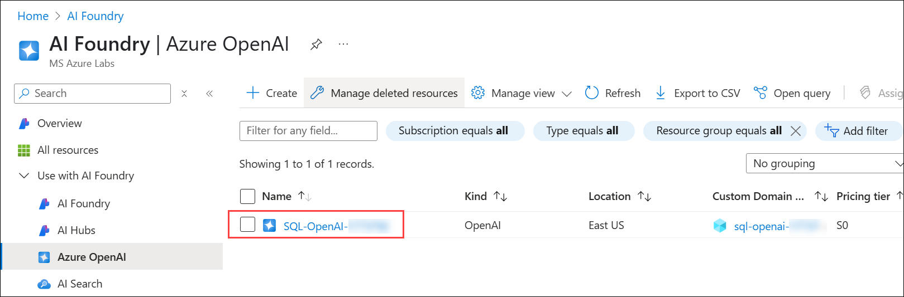

1. In the **Azure OpenAI** resource pane, click **Go to Azure AI Foundry portal** from the top menu bar to navigate to the Azure AI Foundry portal.

   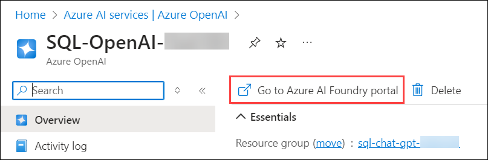
      
1. In Azure AI Foundry, select **Deployments (1)** from the left navigation pane, verify the **gpt-35-turbo** model is deployed with the name **sql-chatgpt-model (2)**, and copy the model name for later use.

   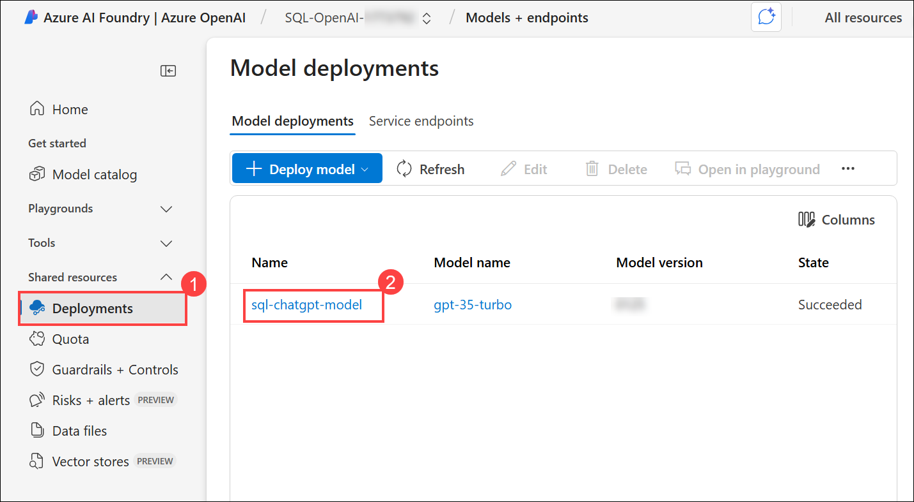

   > **Note**: Click on the **Expand** button, if you dont see the left side navigation pane.

             
   
1. Naviagte back to **Azure portal**, expand **Resource Management (1)** from the left pane, go to **Keys and Endpoint (2)**, click **Show Keys (3)**, then copy **KEY 1 (4)** and the **Endpoint (5)**, and save them in a notepad for later use.

   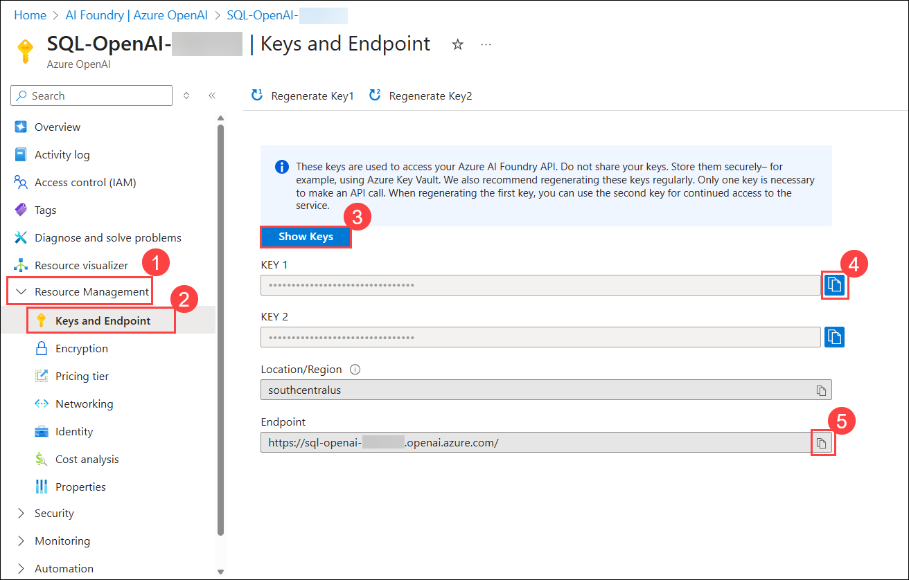
  
## Task 2: Deploy the application to Azure

In this task, you will be reviewing the code in the Visual Studio Code and publishing the application to Azure App Services through CLI.

1. In the LabVM, open **File Explorer** naviagte to the `C:\LabFiles\OpenAIWorkshop-Automation\scenarios\incubations\automating_analytics` **(1)** path, right click on **app.py (2)**, and select **Open with Code (3)**. And take a look at the code to see how it works.

   

   - The provided code is a Streamlit application that consists of two main components: a SQL Query Writing Assistant and a Data Analysis Assistant. The application allows you to interact with an SQL database and perform various tasks.

   - The code begins with importing necessary libraries and dependencies such as Streamlit, Pandas, NumPy, Plotly, and others. It also imports custom modules like AnalyzeGPT, SQL_Query, and ChatGPT_Handler.
  
1. If the pop up appears for **Do you trust the authors of the file in this folder**, click on **Yes, I trust the authors.**

   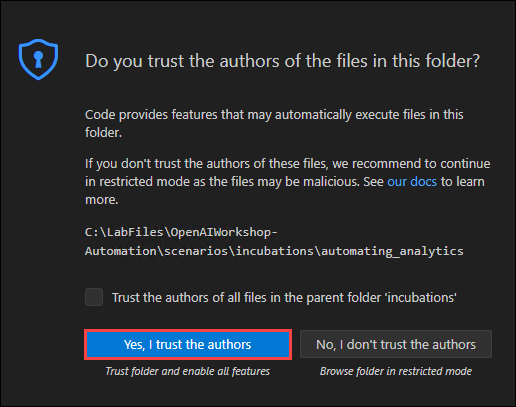

1. In the code snippet, you can configure Azure OpenAI deployment settings and optional SQL Server settings. It provides input fields for entering deployment names, endpoints, API keys, and SQL Server details. With Streamlit, you can save settings and customize the application's functionality. Settings allow you to customize the application's behavior based on your specific needs, enhancing the overall experience.

   

1. The code snippet implements a chat interface leveraging two GPT models, **ChatGPT** and **GPT-4**. It provides a model selection feature, predefined FAQs tailored to each model, and an input form for submitting custom queries. Additionally, it includes configurable options to display the generated code and prompts, offering users enhanced interactivity and transparency within the chat interface.

   

1. The code snippet includes a **Submit** button that initiates a sequence of validation checks and corresponding actions. It ensures that all required Azure OpenAI deployment settings and SQL Server configurations are properly specified. Upon successful validation, the code instantiates an SQL query tool along with an analyzer object. Depending on the value of the index, it executes queries and renders the results using distinct methods.

      
      
1. On the LabVM, navigate to the Desktop and enter **cmd (1)** into the search bar. From the search results, select **Command Prompt (2)** to open the application.

   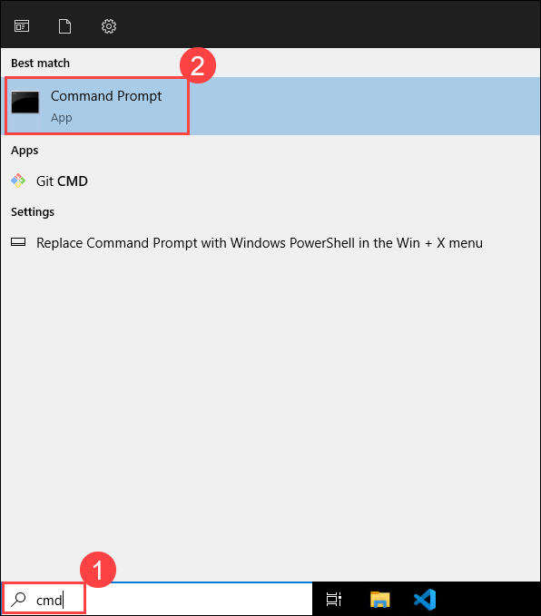

1. Execute the following command to change the current directory.

   ```bash
   cd C:\LabFiles\OpenAIWorkshop-Automation
   ```

   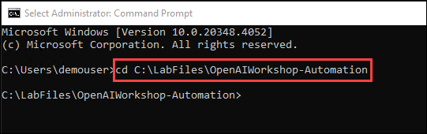

1. Execute the following command to **Authenticate** with **Azure**. It will redirect to Azure authorize website.

   ```bash
   azd auth login
   ```


1. Select the **ODL_User <inject key="Deployment ID" enableCopy="false"/>** account shown to proceed with the **sign-in**.

   

1. You will be signed in to your **Azure account**.

   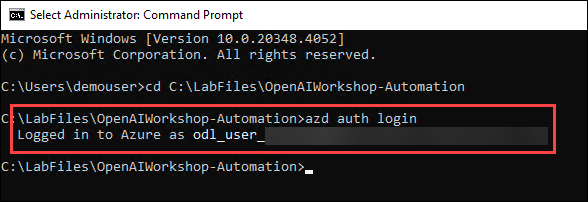

    >**Note:** The warnings can be ignored.

   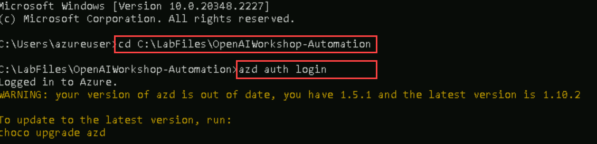

1. Run the following command to set up the resource group deployment and **create a new environment**. Replace `{DeploymentId}` with **<inject key="Deployment ID" enableCopy="true"/>** before executing.

   ```bash
   azd config set alpha.resourceGroupDeployments on
   ```
   
   ```bash
   azd env new sql-chat-gpt-{DeploymentId}
   ```

   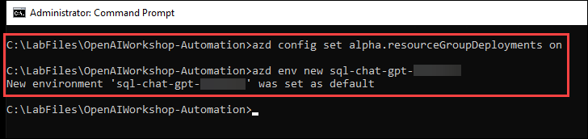

1. Run the following command to provision Azure resources and deploy your project in a single step.

   ```bash
   azd up
   ```

1. Select your Azure subscription by entering `1`, then press **Enter** to continue.

      

1. If prompted to select an **Azure location**, use the arrow keys to navigate and choose **<inject key="Region" enableCopy="false"/>**, then press **Enter** to confirm your selection.

   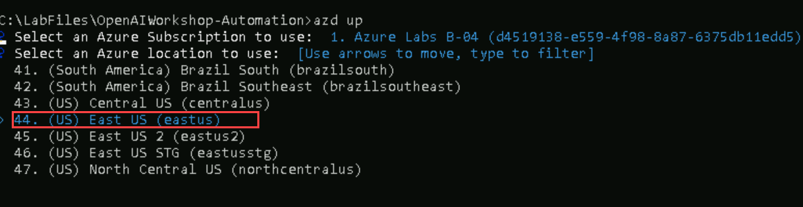

1. Once the deployment is successful, a message will appear confirming: **SUCCESS: Your up workflow to provision and deploy to Azure completed**.

      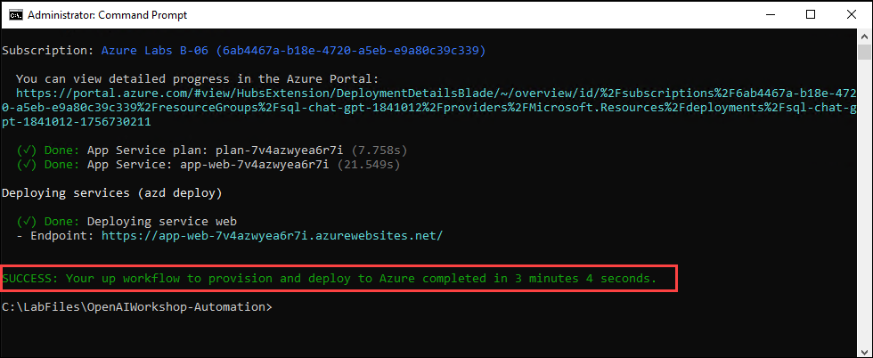

     >**Note:** This process may take approximately 5–10 minutes as it creates the necessary resources, generates the web package, and publishes it to the **App Service**.

1. Navigate back to the Azure portal, search for **App service (1)** and select **App services (2)** from the results.

      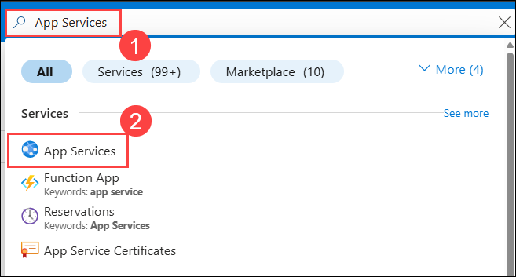

1. Select the available **Web App** that you have deployed in the previous step.

      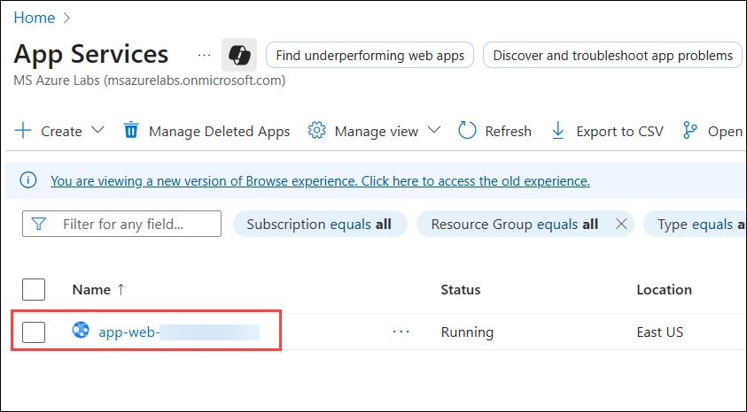

1. Click **Browse** from the top menu to open your deployed web application in a new browser tab.

      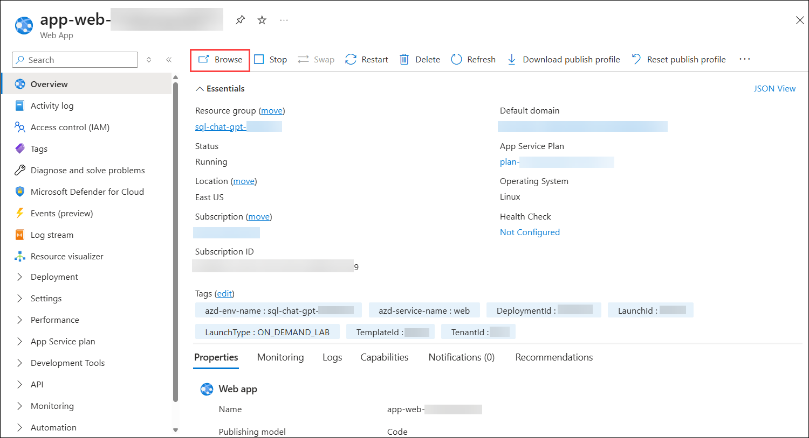
      
      

   > **Congratulations** on completing the task! Now, it's time to validate it. Here are the steps:
   > - If you receive a success message, you can proceed to the next task.
   > - If not, carefully read the error message and retry the step, following the instructions in the lab guide. 
   > - If you need any assistance, please contact us at cloudlabs-support@spektrasystems.com. We are available 24/7 to help you out.

 <validation step="d47c14c0-5c3c-489c-9872-959b900195b5" />

## Summary

In this exercise, you have completed the following:

- Reviewed the Azure OpenAI resource configuration.

- Deployed an application to Azure integrated with the OpenAI service.

### You have successfully completed the lab. Now, click on **Next >>** from the lower right corner to proceed on to the next lab.


