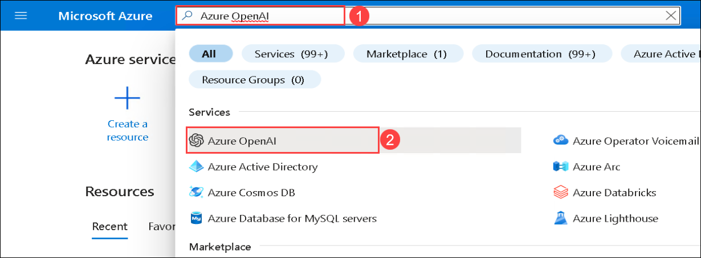
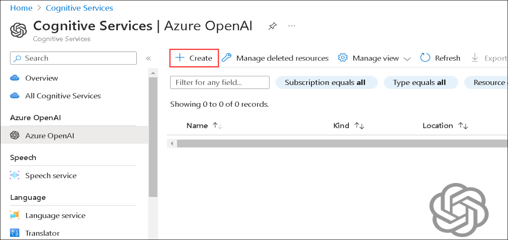
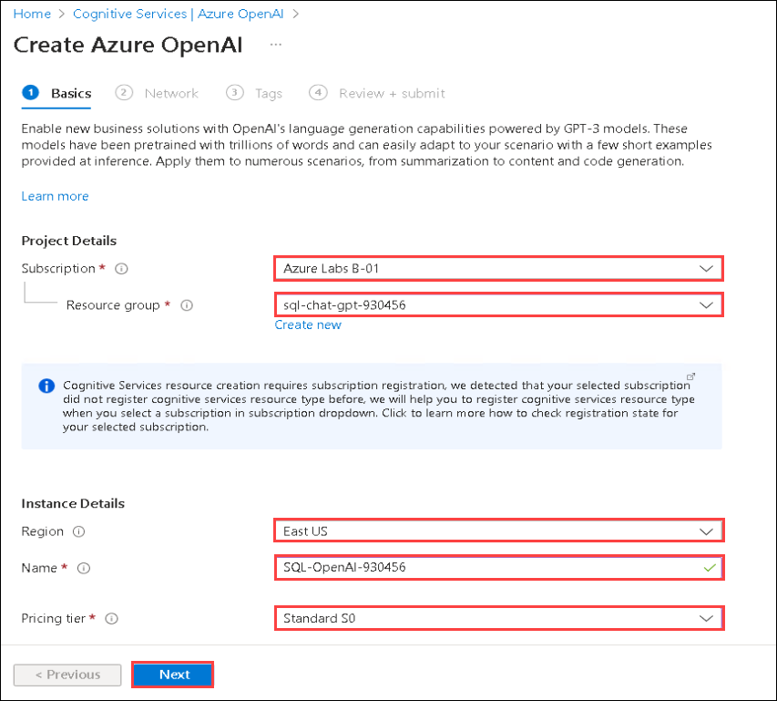
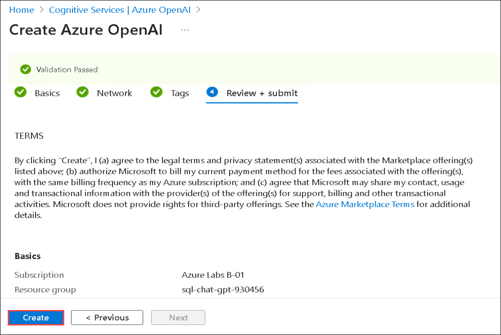
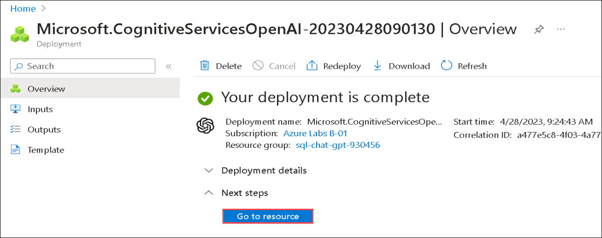
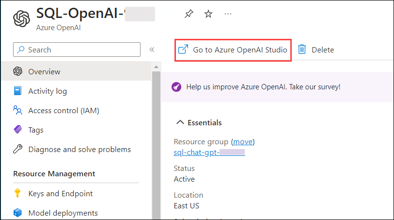
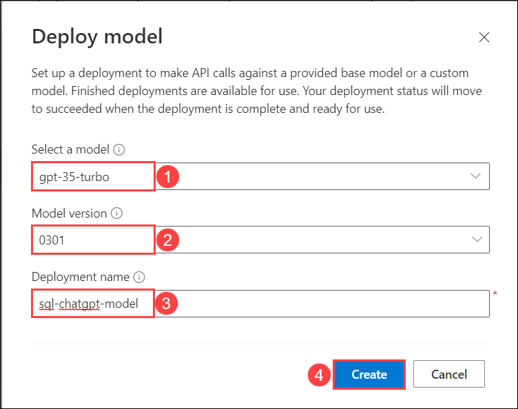
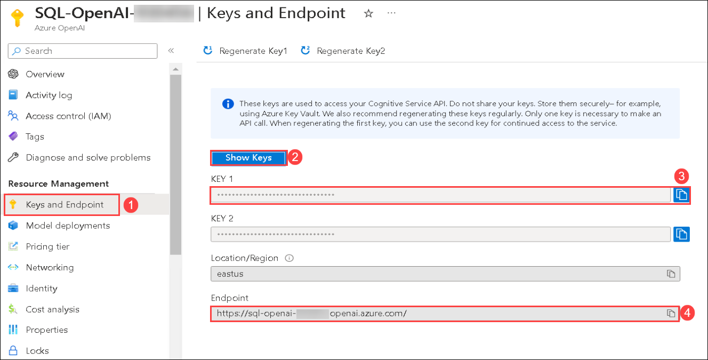
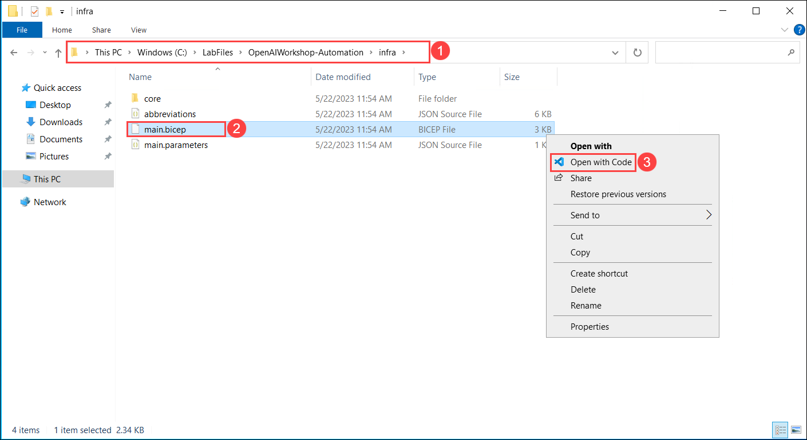
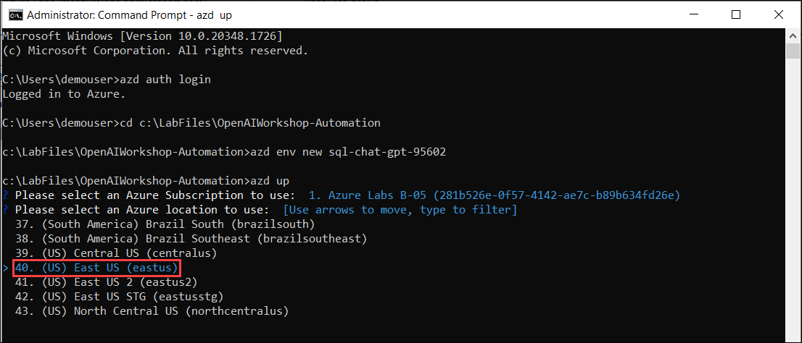

# SQL-ChatGPT-Workshops

## Overview

This application demonstrates the of Open AI (ChatGPT/GPT-4) to help answer business questions by performing advanced data analytic tasks on a business database. Examples of questions are:

 * Simple: Show me daily revenue trends in 2016 per region
 * More difficult: Is that true that top 20% customers generate 80% revenue in 2016?
 * Advanced: Forecast monthly revenue for next 12 months starting from June-2018

The application supports Python's built-in SQLITE as well as your own Microsoft SQL Server.

## Exercise 1: Open AI setup and Installation of Application

In this exercise, you will be setting up the Open AI resource and installtion of application locally.

### Task 1: Create Open AI resource

1. In the Azure portal, search for **Azure OpenAI** **(1)** in the top search box then select **Azure OpenAI** **(2)** under services.

   
   
1. From the **Cognitive Services | Azure OpenAI** pane, click on **Create**.

   
   
1. In the Create Azure OpenAI pane under Basics tab, select the default subscription and select the existing **sql-chat-gpt-<inject key="Deployment ID" enableCopy="false"/>** resource group. Select **East US** as Region, enter Name as **SQL-OpenAI-<inject key="Deployment ID" enableCopy="false"/>** and select **Standard S0** for Pricing tier. Click on **Next**

   
   
1. Leave default settings for Network and Tags tabs, click on **Next**.

1. In the Review + submit pane, verify that validation passed and then click on **Create**.

   
   
1. Deployment will take 5 minutes to complete. Once the deployments is succeeded, click on **Go to resource**.

   
   
1. In the Azure OpenAI resource pane, click on **Go to Azure OpenAI Studio** it will navaigate to **Azure AI Studio**.

   
   
1. In the **Azure AI Studio**, select **Deployments (1)** under Management and click on **+ Create new deployment (2)**    
   
   
   
1.  On the Deploy model pop-up, from the drop-down select **gpt-35-turbo (1)** for Select a Model, then select the Modle version **0301 (2)**, enter deployment name as **sql-chatgpt-model (3)** then click on **Save (4)**. Copy OpenAI Model name into the text file for later use.
  
      

1. Naviagte back to [Azure portal](http://portal.azure.com/), search and select **Azure OpenAI**, from the **Cognitive Services | Azure OpenAI pane**, select the **SQL-OpenAI-<inject key="Deployment ID" enableCopy="false"/>**.

1. Now select **Keys and Endpoints** **(1)** under Resource Management and click on **Show Keys** **(2)**. Copy the **KEY 1** **(3)** and **Endpoint** **(4)**, store it in a text file for later use.

   
      
### Task 2: Deploy the application to Azure

1. In the LabVM, open **File Explorer** naviagte to the `C:\LabFiles\OpenAIWorkshop-Automation\scenarios\incubations\automating_analytics` **(1)** path, right click on **app.py (2)**, and select **Open with Code (3)**. Take a look at the code to see how it works.

   

   - The provided code is a Streamlit application that consists of two main components: a SQL Query Writing Assistant and a Data Analysis Assistant. The application allows you to interact with a SQL database and perform various tasks.

   - The code begins with importing necessary libraries and dependencies such as Streamlit, Pandas, NumPy, Plotly, and others. It also imports custom modules like AnalyzeGPT, SQL_Query, and ChatGPT_Handler.

   - The settings for the application are loaded from environment variables or default values using the load_setting function. These settings include Azure OpenAI deployment names, endpoint, API key, SQL engine, server, database, username, password, and SQLite database path. The settings can be modified through the sidebar in the Streamlit interface.

   - The code defines functions for saving the OpenAI settings, toggling the display of settings in the sidebar, and loading the settings from the session. It also sets up the Azure OpenAI configuration using the provided settings.

   - The Streamlit page configuration is set, and the sidebar is created using the st.sidebar context manager. It includes radio buttons for selecting the app type (SQL Query Writing Assistant or Data Analysis Assistant), a button for accessing settings, and a radio button for selecting the GPT model (ChatGPT or GPT-4). There is also an input area for asking questions and checkboxes for showing code and prompts.

   - Based on the selected app type and GPT model, the system message, few-shot examples, and extract patterns are defined. The extract patterns are used to extract relevant information from the model's response.

   - The code provides a list of predefined FAQs for each GPT model. The selected question is passed to the respective assistant, which processes the question, extracts relevant information, executes SQL queries if necessary, and provides the results to the you. You can choose to display the code, prompt, and break down the execution steps.
   
   - In summary, the Python script creates a web application for SQL query writing assistance and data analysis assistance. It integrates with the OpenAI GPT-3.5 model for natural language processing tasks and allows you to interact with the application through a user-friendly interface.
      
2. In the LabVM, navigate to Desktop and search for `cmd` in the search box then click on **Command Prompt**.

3. Run the below command to change the directory.

   ```bash
   cd C:\LabFiles\OpenAIWorkshop-Automation
   ```

4. Run the below command to **Authenticate with Azure**. It will redirect to Azure authorize website, select your account.

   ```bash
   azd auth login
   ```

5. Run the below command to setup the resource group deployment and **Create a new environment** and replace `{DeploymentId}` with **<inject key="Deployment ID" enableCopy="false"/>**.

   ```bash
   azd config set alpha.resourceGroupDeployments on
   azd env new sql-chat-gpt-{DeploymentId}
   ```

6. Run the below command to Provision Azure resources, and deploy your project with a single command.

   ```bash
   azd up
   ```

7. Please select your Azure Subscription to use, enter `1` and click on **Enter** button.

      

8. Please select an Azure location to use, select the location same as **Resource Group** location, and click on **Enter** button. You can change the location using up and down arrow.

      

9. Once the deployment succeeds you will should see the following message **SUCCESS: Your application was provisioned and deployed to Azure**. The deployment might take above 5 minutes .

      

10. Naviagte back to the Azure portal, search and select **App service**, select the available web app which you have deployed in the previous step.

      

11. Next, click on **Browse** to open your Web application.

      
      
      

12. Click the **Next** button located in the bottom right corner of this lab guide to continue with the next exercise.

## Summary

In this exercise, you have completed OpenAI Setup and hosting a demo application locally. You will be exploring the demo application in the next exercise, click **Next** to continue with the lab.
   
