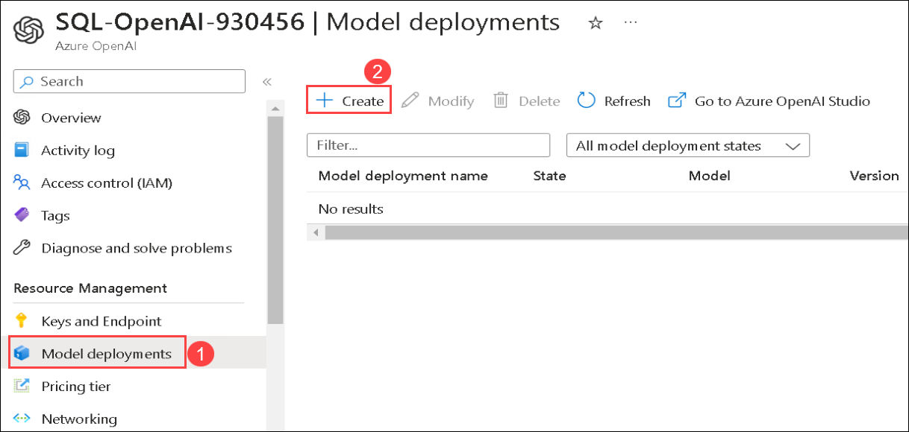
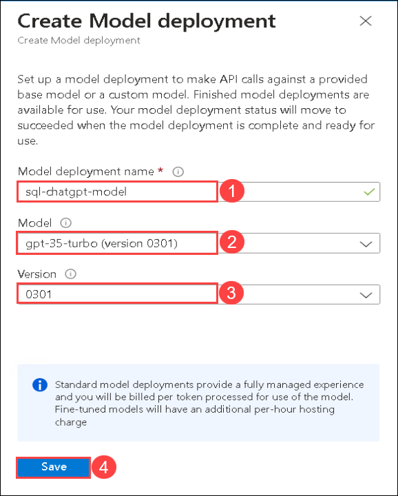

# SQL-ChatGPT-Workshops

## Overview

This application demonstrates the of Open AI (ChatGPT/GPT-4) to help answer business questions by performing advanced data analytic tasks on a business database. Examples of questions are:

 * Simple: Show me daily revenue trends in 2016 per region
 * More difficult: Is that true that top 20% customers generate 80% revenue in 2016?
 * Advanced: Forecast monthly revenue for next 12 months starting from June-2018

The application supports Python's built-in SQLITE as well as your own Microsoft SQL Server.

## Exercise 1: Installation / Open AI setup

In this exercise, you will be setting up the Open AI resource and installtion of application locally.

### Task 1: Create Open AI resource

1. In the Azure portal, search for **Azure OpenAI** **(1)** in the top search box then select **Azure OpenAI** **(2)** under services.

   
   
1. From the **Cognitive Services | Azure OpenAI** pane, click on **Create**.

   
   
1. In the Create Azure OpenAI pane under Basics tab, select the default subscription and select the existing **sql-chat-gpt-<inject key="DeploymentID/Suffix" enableCopy="false"/>** resource group. Select **East US** as Region, enter Name as **SQL-OpenAI-<inject key="DeploymentID/Suffix" enableCopy="false"/>** and select **Standard S0** for Pricing tier. Click on **Next**

   
   
1. Leave default settings for Network and Tags tabs, click on **Next**.

1. In the Review + submit pane, verify that validation passed and then click on **Create**.

   
   
1. Deployment will take 5 minutes to complete. Once the deployments is succeeded, click on **Go to resource**.

   
   
1. In the Azure OpenAI resource pane, select **Model deployments** **(1)** under Resource Management and then click on **Create** **(2)**.

   
   
1. You will see create model deployment pane appears in the right-side, enter the Model deployement name as **sql-chatgpt-model** **(1)** and select **gpt-35-turbo** **(2)** Model deployment with the version **0301** **(3)** then click on **Save** **(4)**.

   
   
1. 
