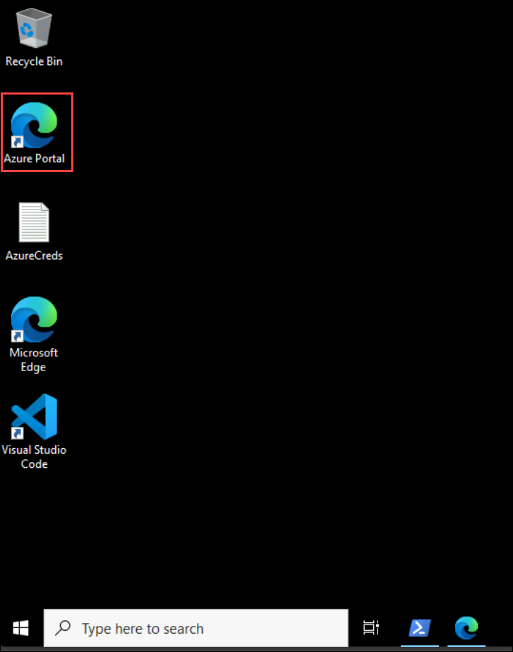
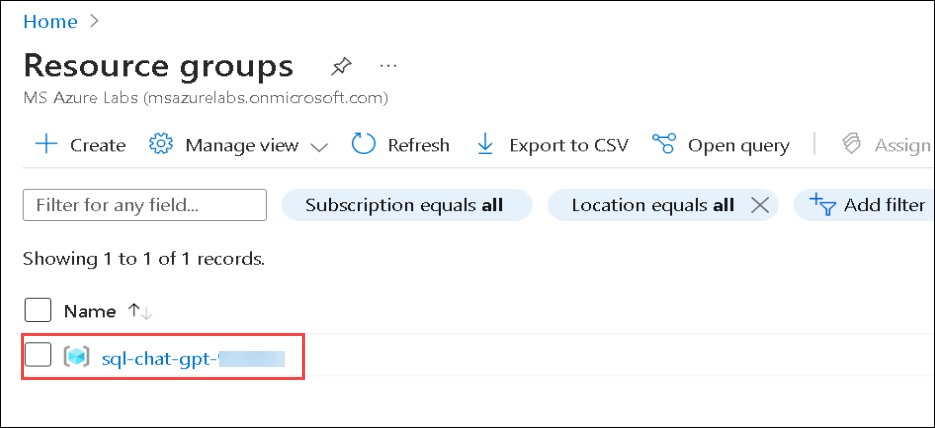
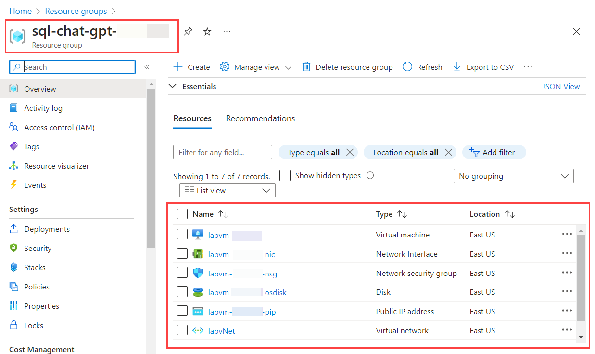

# Azure OpenAI + NLP using ChatGPT on SQL Engine

## Overall Estimated Duration: 4 Hours

## Overview

In this lab, you will explore an application that integrates Azure OpenAI's ChatGPT with advanced data analytics to provide in-depth business insights. The application leverages AI to uncover emerging trends, analyze customer behaviors, and forecast future outcomes, enabling businesses to make informed, strategic decisions based on comprehensive data analysis. You will learn how to utilize Azure App Services for scalable and reliable application hosting and Azure OpenAI for cutting-edge natural language processing. This lab will guide you through transforming complex data into actionable intelligence, enhancing your understanding and operational efficiency.

## Objective

Understand how to set up OpenAI in Azure, deploy it to Azure App Service, and leverage AI-driven tools for effective data analysis and SQL query generation. By the end of this lab, participants will be able to : 

- **Open AI Setup and Installation of Application** : Learn to review and configure an OpenAI resource in Azure, followed by deploying an application to Azure App Service using the command-line interface. This exercise will cover setting up the resource, ensuring its proper integration, and successfully hosting the application in the cloud.
- **Quick Start With Hosted Demo Application** : Learn to interact with the hosted Demo Application, utilizing the Data Analysis Assistant and SQL Query Writing Assistant. This exercise focuses on analyzing data and leveraging AI tools to streamline data analysis and query generation.

## Pre-requisites
- **Fundamental Knowledge of Azure Services** : Knowing about some of the basic services like App Services.
- **Basic Understanding Programming Language** : basic understanding of programming languages like python or csharp.

## Architecture

In this hands-on lab, you will deploy a Python or C# web application to Azure App Services via the CLI and integrate it with an Azure OpenAI resource. The application features two tools: the Data Analysis Assistant, which uses AI to uncover insights and trends from data, and the SQL Query Writing Assistant, which helps users generate and optimize SQL queries from natural language inputs. You will configure the application to handle user requests, leveraging Azure OpenAI to deliver intelligent, data-driven responses and query support.

## Architecture Diagram

## Explanation of Components
- **Azure Open AI** : Azure OpenAI provides advanced natural language processing capabilities through models like ChatGPT. In this lab, it powers the Data Analysis Assistant and SQL Query Writing Assistant, enabling the application to analyze data, generate insights, and convert natural language inputs into SQL queries.
- **Azure App Services** : Azure App Services is a fully managed platform for building, deploying, and scaling web applications. In this lab, it hosts the web application, providing a scalable and reliable environment for integrating with Azure OpenAI and delivering AI-driven functionalities to users.
- **Visual Studio Code** : Visual Studio Code is a versatile code editor used for developing and managing the web application code in this lab.

## Getting Started with Lab

1. Once the environment is provisioned, a virtual machine (JumpVM) and lab guide will get loaded in your browser. Use this virtual machine throughout the workshop to perform the lab. You can see the number on the bottom of the lab guide to switch to different exercises of the lab guide.

   
 
1. To get the lab environment details, you can select the **Environment Details** tab. Additionally, the credentials will also be emailed to your registered email address. You can also open the Lab Guide in a separate and full window by selecting the **Split Window** from the lower right corner. Also, you can start, stop and restart virtual machines from the **Resources** tab.

   
 
   > You will see the SUFFIX value on the **Environment Details** tab, use it wherever you see SUFFIX or DeploymentID in lab steps.
 
## Login to Azure Portal

1. In the JumpVM, click on the Azure portal shortcut of the Microsoft Edge browser which is created on the desktop.

   
   
1. On the **Sign in to Microsoft Azure** tab you will see the login screen, in that enter the following email/username, and click on **Next**. 

   * **Email/Username**: <inject key="AzureAdUserEmail"></inject>
   
      
     
1. Now enter the following password and click on **Sign in**.
   
   * **Password**: <inject key="AzureAdUserPassword"></inject>
   
      
     
1. If you see the pop-up **Stay Signed in?**, select **No**.

1. If you see the pop-up **You have free Azure Advisor recommendations!**, close the window to continue the lab.

1. If a **Welcome to Microsoft Azure** popup window appears, select **Maybe Later** to skip the tour.
   
1. Now you will see the Azure Portal Dashboard, click on **Resource groups** from the Navigate panel to see the resource groups.

   
   
1. Confirm that you have all resource groups present as shown below.

   
   
1. Verify the resources deployed in the resource group.

   
   
1. Now, click on **Next** from the lower right corner to move on to the next page.

In this lab, you will review the Open AI deployments and review the code and publish it to Azure App Services. You will work with the hosted application and leverage AI tools to streamline data analysis and query generation

## Support Contact

The CloudLabs support team is available 24/7, 365 days a year, via email and live chat to ensure seamless assistance at any time. We offer dedicated support channels tailored specifically for both learners and instructors, ensuring that all your needs are promptly and efficiently addressed.

Learner Support Contacts:

- Email Support: labs-support@spektrasystems.com
- Live Chat Support: https://cloudlabs.ai/labs-support

## Happy Learning!!
