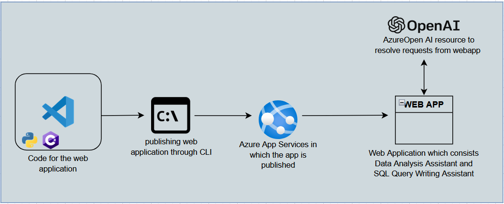
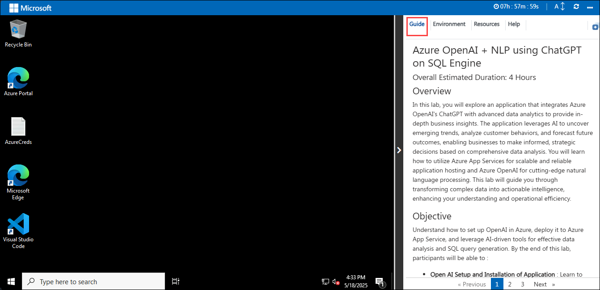
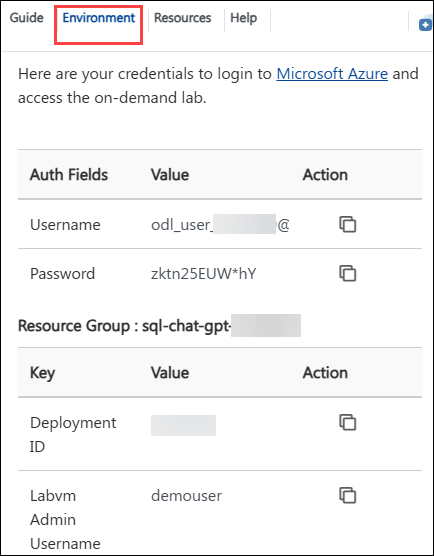
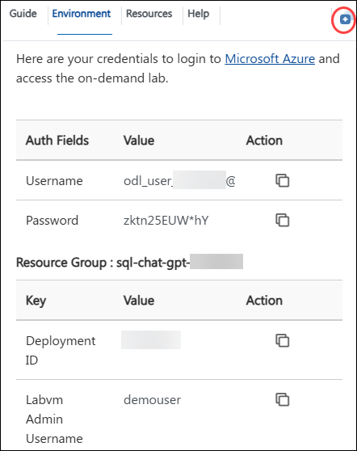
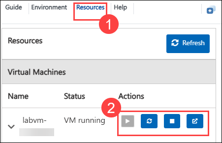

# Azure OpenAI + NLP using ChatGPT on SQL Engine

### Overall Estimated Duration: 4 Hours 

## Overview

In this lab, you will explore an application that integrates Azure OpenAI's ChatGPT with advanced data analytics to provide in-depth business insights. The application leverages AI to uncover emerging trends, analyze customer behaviors, and forecast future outcomes, enabling businesses to make informed, strategic decisions based on comprehensive data analysis. You will learn how to utilize Azure App Services for scalable and reliable application hosting and Azure OpenAI for cutting-edge natural language processing. This lab will guide you through transforming complex data into actionable intelligence, enhancing your understanding and operational efficiency.

## Objective

Understand how to set up OpenAI in Azure, deploy it to Azure App Service, and leverage AI-driven tools for effective data analysis and SQL query generation. By the end of this lab, participants will be able to : 

- **Open AI Setup and Installation of Application** : Learn to review and configure an OpenAI resource in Azure, followed by deploying an application to Azure App Service using the command-line interface. This exercise will cover setting up the resource, ensuring its proper integration, and successfully hosting the application in the cloud.
- **Quick Start With Hosted Demo Application** : Learn to interact with the hosted Demo Application, utilizing the Data Analysis Assistant and SQL Query Writing Assistant. This exercise focuses on analyzing data and leveraging AI tools to streamline data analysis and query generation.

## Pre-requisites

Participants should have the following prerequisites:

- **Fundamental Knowledge of Azure Services**: Knowing about some of the basic services like App Services.
- **Basic Understanding of Programming Language**: basic understanding of programming languages like python or csharp.

## Architecture

In this hands-on lab, you will deploy a Python or C# web application to Azure App Services via the CLI and integrate it with an Azure OpenAI resource. The application features two tools: the Data Analysis Assistant, which uses AI to uncover insights and trends from data, and the SQL Query Writing Assistant, which helps users generate and optimize SQL queries from natural language inputs. You will configure the application to handle user requests, leveraging Azure OpenAI to deliver intelligent, data-driven responses and query support.

## Architecture Diagram

## Explanation of Components

The architecture for this lab involves the following key components:

- **Azure Open AI** : Azure OpenAI provides advanced natural language processing capabilities through models like ChatGPT. In this lab, it powers the Data Analysis Assistant and SQL Query Writing Assistant, enabling the application to analyze data, generate insights, and convert natural language inputs into SQL queries.
- **Azure App Services** : Azure App Services is a fully managed platform for building, deploying, and scaling web applications. In this lab, it hosts the web application, providing a scalable and reliable environment for integrating with Azure OpenAI and delivering AI-driven functionalities to users.
- **Visual Studio Code** : Visual Studio Code is a versatile code editor used for developing and managing the web application code in this lab.

## Getting Started with the Lab

Welcome to your SQL-ChatGPT-Workshop workshop! We've prepared a seamless environment for you to explore and learn about Azure services. Let's begin by making the most of this experience:
 
## Accessing Your Lab Environment
 
Once you're ready to dive in, your virtual machine and guide will be right at your fingertips within your web browser.

  

### Virtual Machine & Lab Guide
 
In the integrated environment, the lab VM serves as the designated workspace, while the lab guide is accessible on the right side of the screen.

**Note**: Kindly ensure that you are following the instructions carefully to ensure the lab runs smoothly and provides an optimal user experience.
 
## Exploring Your Lab Resources
 
To get a better understanding of your lab resources and credentials, navigate to the **Environment** tab.

  
 
## Utilizing the Split Window Feature
 
For convenience, you can open the lab guide in a separate window by selecting the **Split Window** button from the Top right corner.

  
 
## Managing Your Virtual Machine
 
Feel free to start, stop, or restart your virtual machine as needed from the **Resources** tab. Your experience is in your hands!
 
  

## Lab Guide Zoom In/Zoom Out

To adjust the zoom level for the environment page, click the **A↕ : 100%** icon located next to the timer in the lab environment.

## Let's Get Started with Azure Portal

1. In the JumpVM, click on the Azure portal shortcut of the Microsoft Edge browser which is created on the desktop.

   
   
1. On the **Sign in to Microsoft Azure** tab you will see the login screen, in that enter the following email/username, and click on **Next**. 

   * **Email/Username**: <inject key="AzureAdUserEmail"></inject>
   
      
     
1. Now enter the following password and click on **Sign in**.
   
   * **Password**: <inject key="AzureAdUserPassword"></inject>
   
      

1. If you see the pop-up **Stay Signed in?**, select **No**.

      > **Note**: If prompted with MFA, please follow the steps highlighted under - [Steps to Proceed with MFA Setup if Ask Later Option is Not Visible](#steps-to-proceed-with-mfa-setup-if-ask-later-option-is-not-visible)

1. If you see the pop-up **You have free Azure Advisor recommendations!**, close the window to continue the lab.

1. If a **Welcome to Microsoft Azure** popup window appears, select **Cancel** to skip the tour.
   
1. Now you will see the Azure Portal Dashboard, click on **Resource groups** from the Navigate panel to see the resource groups.

   
   
1. Confirm that you have all resource groups present as shown below.

   
   
1. Verify the resources deployed in the resource group.

   

## Steps to Proceed with MFA Setup if Ask Later Option is Not Visible

   > **Note:** Continue with the exercises if MFA is already enabled or the option is unavailable.

1. At the **"More information required"** prompt, select **Next**.

1. On the **"Keep your account secure"** page, select **Next** twice.

1. **Note:** If you don’t have the Microsoft Authenticator app installed on your mobile device:

   - Open **Google Play Store** (Android) or **App Store** (iOS).
   - Search for **Microsoft Authenticator** and tap **Install**.
   - Open the **Microsoft Authenticator** app, select **Add account**, then choose **Work or school account**.

1. A **QR code** will be displayed on your computer screen.

1. In the Authenticator app, select **Scan a QR code** and scan the code displayed on your screen.

1. After scanning, click **Next** to proceed.

1. On your phone, enter the number shown on your computer screen in the Authenticator app and select **Next**.
       
1. If prompted to stay signed in, you can click **No**.

1. If a **Welcome to Microsoft Azure** popup window appears, click **Cancel** to skip the tour.
 
1. Now, click on the **Next** from the lower right corner to move to the next page.

In this lab, you will review the Open AI deployments and review the code and publish it to Azure App Services. You will work with the hosted application and leverage AI tools to streamline data analysis and query generation

## Support Contact

The CloudLabs support team is available 24/7, 365 days a year, via email and live chat to ensure seamless assistance at any time. We offer dedicated support channels tailored specifically for both learners and instructors, ensuring that all your needs are promptly and efficiently addressed.

Learner Support Contacts:

- Email Support: cloudlabs-support@spektrasystems.com
- Live Chat Support: https://cloudlabs.ai/labs-support

Now, click on **Next** from the lower right corner to move on to the next page.

### Happy Learning!!
